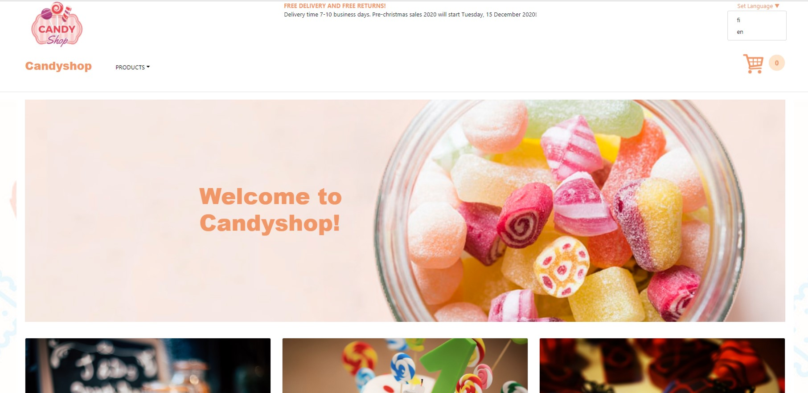

# Candyshop
Candyshop is an online selling app which is created to sell candy products. 
The app includes product categories, a shopping cart and an order processing option. 
Candyshop is a single-page application that applies React.js for front-end development and Spring Boot for back-end.
Database uses MySQL. 

## Application features
The client can add products to the shopping cart and delete the products from it. 
The app includes a language setting options which is done by using i18next framework.
The shopping cart displays the summary of its content such as the total price and the total amount of the products.
The client can proceed to checkout, where he/she has to fill a form that includes essential delivery information.
After that there will appear an order summary with all products, total costs and client's information. 
Finally, the client can confirm the order or go back to previous order states and make some changes. 

## Application images
Screeshots below illustrate views of the application.

Main Page


Product Category <i>Birthday Party</i>


Shopping Cart


Delivery Information Form


Order Summary


Thank You page


## Installing the project
Candyshop is a maven project, therefore to launch this application you need run mvn install at project root.
```
  $ mvn install
```

This composes a jar file in target folder. 
Executing this jar file launches both the frontend at localhost:8080 and the backend. 
Application is ready to use at this point.

### Installing npm
To get React.js working, you need to install npm to download the dependencies in the local node_modules folder.
```
  $ npm install
```
By default, npm install will install all modules listed as dependencies in package.json.